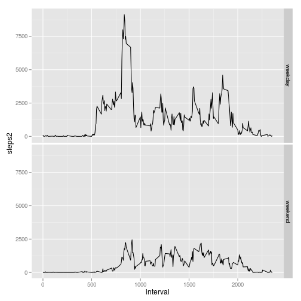

## Loading and preprocessing the data


```r
activity <- read.csv("activity.csv")
```


## What is mean total number of steps taken per day?


```r
activityPerDay <- with(activity, aggregate(steps, by = list(date = date), FUN = function(x) {
    mean(x, na.rm = T)
}))
hist(activityPerDay$x)
```

 

```r
mean(activityPerDay$x, na.rm = T)
```

```
## [1] 37.38
```

```r
median(activityPerDay$x, na.rm = T)
```

```
## [1] 37.38
```


## What is the average daily activity pattern?


```r
activityPerInterval <- with(activity, aggregate(steps, by = list(interval = interval), 
    FUN = function(x) {
        mean(x, na.rm = T)
    }))
with(activityPerInterval, plot(interval, x, type = "l"))
```

 


The interval with the greatest activity is:


```r
activityPerInterval$interval[which.max(activityPerInterval$x)]
```

```
## [1] 835
```


## Imputing missing values

Let's see the number of missing values:


```r
sum(is.na(activity$steps))
```

```
## [1] 2304
```


We replace the missing values by the mean of the closest previous measure and
the closest next measure:


```r
activity$steps2 <- activity$steps
for (i in 1:length(activity$steps2)) if (is.na(activity$steps2[i])) {
    before <- rev(which(!is.na(activity$steps[1:i])))[1]
    after <- which(!is.na(activity$steps[-(1:i)]))[1] + i
    if (!is.na(before) & !is.na(after)) {
        activity$steps2[i] <- (activity$steps2[before] + activity$steps2[after])/2
    } else if (!is.na(before)) {
        activity$steps2[i] <- activity$steps2[before]
    } else {
        activity$steps2[i] <- activity$steps2[after]
    }
}
```


Let's redo the first part of this analysis:


```r
activityPerDay <- with(activity, aggregate(steps2, by = list(date = date), FUN = mean))
hist(activityPerDay$x)
```

 

```r
mean(activityPerDay$x)
```

```
## [1] 32.48
```

```r
median(activityPerDay$x)
```

```
## [1] 36.09
```


Most missing values have been replaced by 0. The mean and median are thus lower.

## Are there differences in activity patterns between weekdays and weekends?


```r
activity$day <- weekdays(strptime(activity$date, "%Y-%m-%d"))
activity$day <- with(activity, replace(day, day == "samedi" | day == "dimanche", 
    "weekend"))
activity$day <- with(activity, replace(day, day != "weekend", "weekday"))
activity$day <- factor(activity$day)
library(ggplot2)
p <- ggplot(activity, aes(x = interval, y = steps2))
p <- p + stat_summary(fun.y = "sum", geom = "line")
p <- p + facet_grid(day ~ .)
print(p)
```

 

